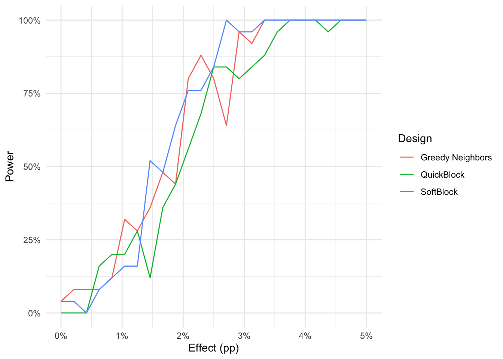
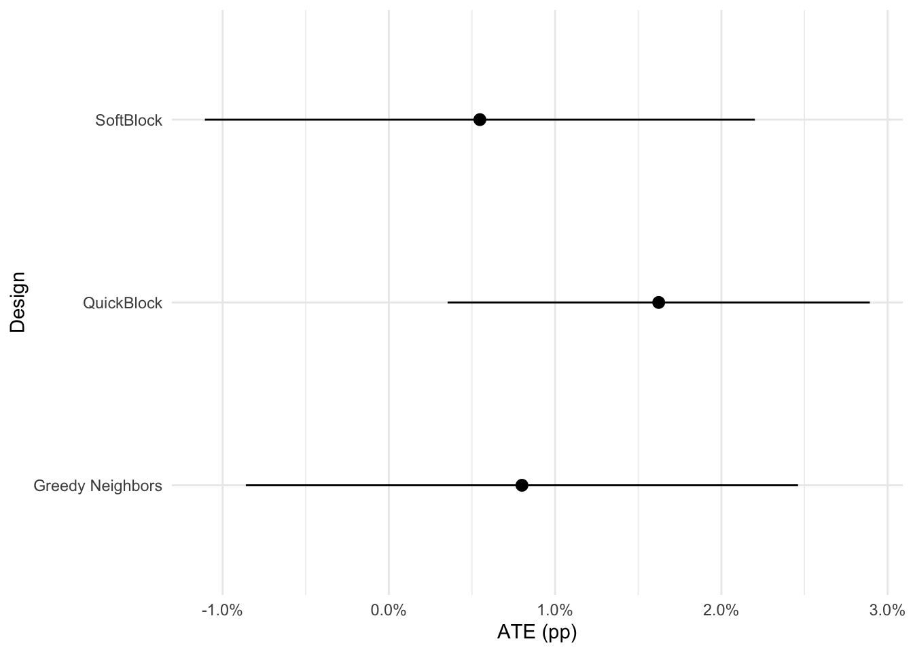
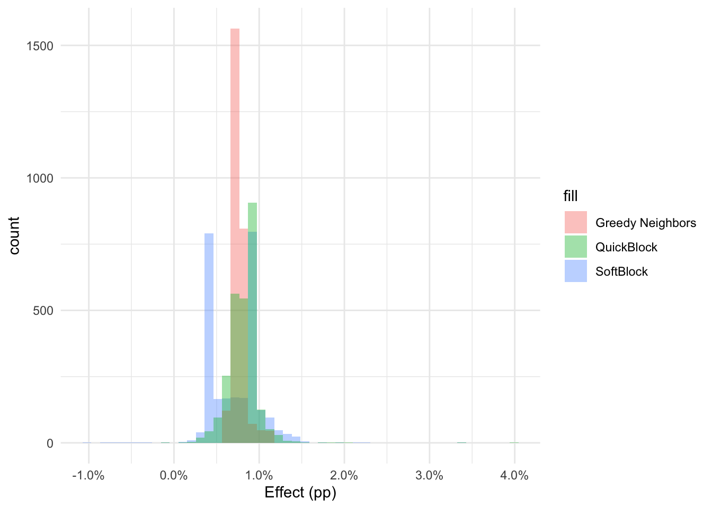

> **Abstract.** This is a demo of using SoftBlock for experimental design for a notional randomization of precincts in North Carolina. To optimize power, we focus on ensuring very similar patterns of prior voting patterns in treatment and in control. This demo walks through all the necessary steps for this process and shows how to perform estimation of average and heterogeneous effects.

*This post was originally written as an executed Quarto document. The code below is
shown exactly as it ran; the figures, printed values and tables are the outputs
captured from that original render.*

## Introduction

In particular, I'm going to imagine that I'm designing an experiment in which I assign different treatments to particular precincts in North Carolina. In order to optimize power, of course, we want to make sure that our two test groups look as similar as possible in terms of prior voting patterns.

Thus, the steps in this design will be:

1. Collect relevant historical data.
2. Define variables on which we wish to balance.
3. Allocate treatment assignment using new methods.
4. Simulate the power of hypothesis tests under the proposed design.
5. Fake some outcome data and analyze it for average and heterogeneous treatment effects.

## Implementation of methods

### Description

The relevant API is a function with `tidyverse` semantics called `assign_softblock` (or `assign_greedy_neighbors`). These functions accept a vector of columns to be used in the design. The SoftBlock version additionally accepts two arguments, `.s2` for the bandwidth of the RBF kernel to use in the construction of a similarity matrix as well as `.neighbors` which indicates the number of nearest neighbors to include in the graph on which to construct the spanning tree. These parameters don't generally need to be modified.

### Source Code

<details><summary>See source code</summary>

```r
writeLines(readLines("https://raw.githubusercontent.com/ddimmery/softblock/master/r_implementation.R"))
```

```text
library(Matrix)
library(igraph)
library(FNN)
library(hash)

assign_greedily <- function(graph) {
    adj_mat = igraph::as_adjacency_matrix(graph, type="both", sparse=TRUE) != 0
    N = nrow(adj_mat)
    root_id = make.keys(sample(N, 1))

    a = rbinom(1, 1, 0.5)
    visited = hash()

    random_order = make.keys(sample(N))
    unvisited = hash(random_order, random_order)

    colors = hash()
    stack = hash()

    stack[[root_id]] <- a
    tentative_color = rbinom(N, 1, 0.5)
    while ((!is.empty(unvisited)) || (!is.empty(stack))) {
        if (is.empty(stack)) {
            cur_node = keys(unvisited)[1]
            del(cur_node, unvisited)
            color = tentative_color[as.integer(cur_node)]
        } else {
            cur_node = keys(stack)[1]
            color = stack[[cur_node]]
            del(cur_node, stack)
            del(cur_node, unvisited)
        }
        visited[[cur_node]] = cur_node
        colors[[cur_node]] = color
        children = make.keys(which(adj_mat[as.integer(cur_node), ]))
        for (child in children) {
            if(has.key(child, unvisited)) {
                stack[[child]] = 1 - color
            }
        }
    }
    values(colors, keys=1:N)
}


assign_softblock <- function(.data, cols, .s2=2, .neighbors=6) {
    expr <- rlang::enquo(cols)
    pos <- tidyselect::eval_select(expr, data = .data)
    df_cov <- rlang::set_names(.data[pos], names(pos))
    cov_mat = scale(model.matrix(~.+0, df_cov))
    N = nrow(cov_mat)
    st = lubridate::now()
    knn = FNN::get.knn(cov_mat, k=.neighbors)
    st = lubridate::now()
    knn.adj = Matrix::sparseMatrix(i=rep(1:N, .neighbors), j=c(knn$nn.index), x=exp(-c(knn$nn.dist) / .s2))
    knn.graph <- graph_from_adjacency_matrix(knn.adj, mode="plus", weighted=TRUE, diag=FALSE)
    E(knn.graph)$weight <- (-1 * E(knn.graph)$weight)
    st = lubridate::now()
    mst.graph = igraph::mst(knn.graph)
    E(mst.graph)$weight <- (-1 * E(mst.graph)$weight)
    st = lubridate::now()
    assignments <- assign_greedily(mst.graph)
    .data$treatment <- assignments
    attr(.data, "laplacian") <- igraph::laplacian_matrix(mst.graph, normalize=TRUE, sparse=TRUE)
    .data
}

assign_greedy_neighbors <- function(.data, cols) {
    expr <- rlang::enquo(cols)
    pos <- tidyselect::eval_select(expr, data = .data)
    df_cov <- rlang::set_names(.data[pos], names(pos))
    cov_mat = scale(model.matrix(~.+0, df_cov))
    N = nrow(cov_mat)
    knn = FNN::get.knn(cov_mat, k=1)
    knn.adj = Matrix::sparseMatrix(i=1:N, j=c(knn$nn.index), x=c(knn$nn.dist))
    knn.graph <- graph_from_adjacency_matrix(knn.adj, mode="plus", weighted=TRUE, diag=FALSE)
    assignments <- assign_greedily(knn.graph)
    .data$treatment <- assignments
    attr(.data, "laplacian") <- igraph::laplacian_matrix(knn.graph, normalize=TRUE, sparse=TRUE)
    .data
}

assign_matched_pairs <- function(.data, cols, .s2=2, .neighbors=6) {
    expr <- rlang::enquo(cols)
    pos <- tidyselect::eval_select(expr, data = .data)
    df_cov <- rlang::set_names(.data[pos], names(pos))
    cov_mat = scale(model.matrix(~.+0, df_cov))
    N = nrow(cov_mat)
    knn = FNN::get.knn(cov_mat, k=.neighbors)
    knn.adj = Matrix::sparseMatrix(i=rep(1:N, .neighbors), j=c(knn$nn.index), x=exp(-c(knn$nn.dist) / .s2))
    knn.graph <- graph_from_adjacency_matrix(knn.adj, mode="plus", weighted=TRUE, diag=FALSE)
    E(knn.graph)$weight <- (-1 * E(knn.graph)$weight)
    mwm.graph = igraph::max_bipartite_match(knn.graph)
    E(mwm.graph)$weight <- (-1 * E(mwm.graph)$weight)
    assignments <- assign_greedily(mwm.graph)
    .data$treatment <- assignments
    attr(.data, "laplacian") <- igraph::laplacian_matrix(mwm.graph, normalize=TRUE, sparse=TRUE)
    .data
}

# library(tibble)
# data = tibble(
#     x1=runif(10),
#     x2=runif(10),
#     x3=rbinom(10, 1, 0.5)
# )
# library(dplyr)
# library(tidyr)
# library(ggplot2)
# data %>% assign_softblock(c(x1, x2)) -> newdata

# ggplot(newdata, aes(x=x1, y=x2, color=factor(treatment), shape=factor(x3))) + geom_point() + theme_minimal()

# newdata %>%
#     attr("laplacian") %>%
#     ifelse(lower.tri(.), ., 0) %>%
#     as_tibble() -> adj_df
# names(adj_df) <- paste0(1:ncol(adj_df))

# adj_df %>%
#     group_by(id_1=as.character(row_number())) %>%
#     gather(id_2, weight, -id_1) %>%
#     filter(weight != 0)  %>%
#     mutate(id_2=as.character(id_2), id=paste(id_1, id_2, sep='-')) -> adj_df

# locs = newdata %>% mutate(id=as.character(row_number())) %>% select(id, x1, x2, x3)

# edges=bind_rows(
# adj_df  %>% inner_join(locs, by=c('id_1'='id')),
# adj_df  %>% inner_join(locs, by=c('id_2'='id'))
# ) %>% arrange(id) %>% ungroup()

# pp = ggplot(newdata, aes(x=x1, y=x2)) +
# geom_line(aes(group=id, size=1), data=edges, color='grey') +
# geom_point(aes(color=factor(treatment), shape=factor(x3), size=2), alpha=.9) +
# scale_size_continuous(range=c(1, 3)) +
# theme_minimal() + theme(legend.position='none')

# print(pp)
```

</details>

## Data Preparation

This demo will be based on North Carolina data because their Board of Elections makes it very easy to get precinct level data. I'm also only going to use historical data from the most recent election to avoid needing to match precincts across elections.

With access to a full voter file, this section could be drastically improved by incorporating other important elements into the design like demographics.

### Get Precinct data

#### Results Data

```r
url <- "http://dl.ncsbe.gov/ENRS/2020_11_03/results_pct_20201103.zip"
zip_file <- tempfile(fileext = ".zip")
download.file(url, zip_file, mode = "wb")
spec = cols(
  County = col_character(),
  `Election Date` = col_character(),
  Precinct = col_character(),
  `Contest Group ID` = col_double(),
  `Contest Type` = col_character(),
  `Contest Name` = col_character(),
  Choice = col_character(),
  `Choice Party` = col_character(),
  `Vote For` = col_double(),
  `Election Day` = col_double(),
  `One Stop` = col_double(),
  `Absentee by Mail` = col_double(),
  Provisional = col_double(),
  `Total Votes` = col_double(),
  `Real Precinct` = col_character(),
  X16 = col_skip()
)
results <- readr::read_tsv(zip_file, col_types=spec)
```

#### Shapefiles

```r
url = "https://s3.amazonaws.com/dl.ncsbe.gov/ShapeFiles/Precinct/SBE_PRECINCTS_20201018.zip"
temp <- tempfile()
temp2 <- tempfile()
download.file(url, temp)
unzip(zipfile = temp, exdir = temp2)
nc_SHP_file <- list.files(temp2, pattern = ".shp$",full.names=TRUE)
shapes <- sf::read_sf(nc_SHP_file)
```

### Aggregate Data and Join

```r
results %>%
    filter(`Real Precinct` == 'Y') %>%
    group_by(County, Precinct) %>%
    summarize(
        total_vote_pres=sum(`Total Votes`[`Contest Name` == 'US PRESIDENT'], na.rm=TRUE),
        dem_share_pres=sum(`Total Votes`[`Contest Name` == 'US PRESIDENT' & `Choice Party` == 'DEM'], na.rm=TRUE)/total_vote_pres,
        gop_share_pres=sum(`Total Votes`[`Contest Name` == 'US PRESIDENT' & `Choice Party` == 'REP'], na.rm=TRUE)/total_vote_pres,
        total_vote_senate=sum(`Total Votes`[`Contest Name` == 'US SENATE'], na.rm=TRUE),
        dem_share_senate=sum(`Total Votes`[`Contest Name` == 'US SENATE' & `Choice Party` == 'DEM'], na.rm=TRUE)/total_vote_senate,
        gop_share_senate=sum(`Total Votes`[`Contest Name` == 'US SENATE' & `Choice Party` == 'REP'], na.rm=TRUE)/total_vote_senate,
        total_vote_gov=sum(`Total Votes`[`Contest Name` == 'NC GOVERNOR'], na.rm=TRUE),
        dem_share_gov=sum(`Total Votes`[`Contest Name` == 'NC GOVERNOR' & `Choice Party` == 'DEM'], na.rm=TRUE)/total_vote_gov,
        gop_share_gov=sum(`Total Votes`[`Contest Name` == 'NC GOVERNOR' & `Choice Party` == 'REP'], na.rm=TRUE)/total_vote_gov,
        total_vote_house=sum(`Total Votes`[grepl('US HOUSE OF REPRESENTATIVES DISTRICT', `Contest Name`)], na.rm=TRUE),
        dem_share_house=sum(`Total Votes`[grepl('US HOUSE OF REPRESENTATIVES DISTRICT', `Contest Name`) & `Choice Party` == 'DEM'], na.rm=TRUE)/total_vote_house,
        gop_share_house=sum(`Total Votes`[grepl('US HOUSE OF REPRESENTATIVES DISTRICT', `Contest Name`) & `Choice Party` == 'REP'], na.rm=TRUE)/total_vote_house
    ) %>% ungroup() -> results_agg
inner_join(results_agg, shapes, by=c('County'='county_nam', 'Precinct'='prec_id')) -> df_joined
DT::datatable(df_joined %>% sample_n(size=100) %>% dplyr::select(-geometry), rownames = FALSE, options=list(scrollX=TRUE, autoWidth = TRUE))
```

<div style="overflow-x:auto">

| County | Precinct | total_vote_pres | dem_share_pres | gop_share_pres | total_vote_senate | dem_share_senate | gop_share_senate | total_vote_gov | dem_share_gov | gop_share_gov | total_vote_house | dem_share_house | gop_share_house | id | enr_desc | of_prec_id | county_id | blockid |
| --- | --- | --- | --- | --- | --- | --- | --- | --- | --- | --- | --- | --- | --- | --- | --- | --- | --- | --- |
| WAKE | 16-07 | 462 | 0.3182 | 0.632 | 455 | 0.3099 | 0.6176 | 460 | 0.3978 | 0.5804 | 457 | 0.3414 | 0.6018 | 2319 | 16-07 |  | 92 |  |
| WAKE | 20-11 | 626 | 0.3371 | 0.631 | 621 | 0.3076 | 0.6264 | 622 | 0.3923 | 0.5932 | 605 | 0.3355 | 0.6264 | 2363 | 20-11 |  | 92 |  |
| SWAIN | WHCH | 2005 | 0.5711 | 0.405 | 1976 | 0.5273 | 0.3917 | 1988 | 0.583 | 0.3888 | 1960 | 0.5485 | 0.3908 | 2460 | WHCH |  | 87 |  |
| CRAVEN | 20 | 2615 | 0.356 | 0.6333 | 2598 | 0.3499 | 0.6159 | 2610 | 0.3782 | 0.6142 | 2559 | 0.3369 | 0.6631 | 1498 | FAIRFIELD HARBOUR |  | 25 |  |
| BUNCOMBE | 21.1 | 919 | 0.7367 | 0.2448 | 911 | 0.7179 | 0.2448 | 911 | 0.7684 | 0.2151 | 904 | 0.7334 | 0.2367 | 1808 | HAW CREEK ELEMENTARY SCHOOL |  | 11 |  |
| ORANGE | CS1 | 176 | 0.3409 | 0.625 | 175 | 0.3371 | 0.6286 | 176 | 0.3977 | 0.5511 | 173 | 0.3815 | 0.6185 | 178 | COLES STORE |  | 68 |  |
| GUILFORD | OR2 | 291 | 0.2062 | 0.7629 | 292 | 0.1849 | 0.75 | 294 | 0.2449 | 0.7279 | 289 | 0.2215 | 0.7785 | 966 | OR2 |  | 41 |  |
| HENDERSON | SM | 2513 | 0.2475 | 0.7374 | 2491 | 0.2316 | 0.7206 | 2504 | 0.276 | 0.7065 | 2483 | 0.2384 | 0.7334 | 793 | SOUTH MILLS RIVER |  | 45 |  |
| HOKE | 01 | 274 | 0.3723 | 0.6095 | 270 | 0.3889 | 0.5667 | 273 | 0.4505 | 0.5385 | 269 | 0.3903 | 0.6097 | 736 | ALLENDALE |  | 47 |  |
| GUILFORD | G32 | 270 | 0.3481 | 0.6222 | 271 | 0.3284 | 0.6458 | 270 | 0.4111 | 0.5704 | 261 | 0.3602 | 0.6398 | 919 | G32 |  | 41 |  |

</div>

*The original post rendered this as an interactive `DT::datatable` widget showing a
random sample of 100 precincts. It has been replaced here by the first 10 rows as a
static table — truncated for the static rebuild, so no client-side JavaScript is
needed.*

### Add some geographic features

```r
df_joined$geometry %>%
    st_centroid() %>%
    st_transform("+init=epsg:4326") %>%
    st_coordinates() -> latlong
df_joined$longitude = latlong[, 'X']
df_joined$latitude = latlong[, 'Y']
area = df_joined$geometry %>% st_transform("+init=epsg:4326") %>% st_area()
df_joined$area_km2 = units::drop_units(area) / 1e6 # convert m^2 to km^2
df_joined <- df_joined %>% mutate(vote_density_pres = total_vote_pres / area_km2)
```

## Assign treatment four ways

### Softblock

```r
start_time = lubridate::now()
df_joined %>% assign_softblock(c(
    longitude, latitude, area_km2, vote_density_pres, # geographic
    total_vote_pres, dem_share_pres, gop_share_pres, # 2020 presidential
    total_vote_senate, dem_share_senate, gop_share_senate, # 2020 senate
    total_vote_gov, dem_share_gov, gop_share_gov, # 2020 governor
    total_vote_house, dem_share_house, gop_share_house # 2020 house
)) %>%
rename(treatment_sb=treatment)-> df_joined
softblock_weights <- attr(df_joined, "laplacian")
end_time = lubridate::now()
print(end_time - start_time)
```

```text
Time difference of 0.7473469 secs
```

### Greedy nearest neighbors

```r
start_time = lubridate::now()
df_joined %>% assign_greedy_neighbors(c(
    longitude, latitude, area_km2, vote_density_pres, # geographic
    total_vote_pres, dem_share_pres, gop_share_pres, # 2020 presidential
    total_vote_senate, dem_share_senate, gop_share_senate, # 2020 senate
    total_vote_gov, dem_share_gov, gop_share_gov, # 2020 governor
    total_vote_house, dem_share_house, gop_share_house # 2020 house
)) %>%
rename(treatment_nn=treatment)-> df_joined
nn_weights <- attr(df_joined, "laplacian")
end_time = lubridate::now()
print(end_time - start_time)
```

```text
Time difference of 1.482411 secs
```

### QuickBlock

```r
start_time = lubridate::now()
df_joined %>% dplyr::select(
    longitude, latitude, area_km2, vote_density_pres, # geographic
    total_vote_pres, dem_share_pres, gop_share_pres, # 2020 presidential
    total_vote_senate, dem_share_senate, gop_share_senate, # 2020 senate
    total_vote_gov, dem_share_gov, gop_share_gov, # 2020 governor
    total_vote_house, dem_share_house, gop_share_house # 2020 house
) -> df_qb
qb_blocks = quickblock(as.data.frame(df_qb), size_constraint = 6L)
df_joined$treatment_qb = as.integer(as.character(assign_treatment(qb_blocks, treatments=c('0', '1'))))
end_time = lubridate::now()
print(end_time - start_time)
```

```text
Time difference of 0.03046703 secs
```

### Matched Pairs

```r
# This is extremely slow.
# start_time = lubridate::now()
# df_joined %>% assign_matched_pairs(c(
#     longitude, latitude, area_km2, vote_density_pres, # geographic
#     total_vote_pres, dem_share_pres, gop_share_pres, # 2020 presidential
#     total_vote_senate, dem_share_senate, gop_share_senate, # 2020 senate
#     total_vote_gov, dem_share_gov, gop_share_gov, # 2020 governor
#     total_vote_house, dem_share_house, gop_share_house # 2020 house
# )) %>%
# rename(treatment_mp=treatment)-> df_joined
# mp_weights <- attr(df_joined, "laplacian")
# end_time = lubridate::now()
# print(end_time - start_time)
```

## Power simulation

To do power calculations consistently across methods, I will do the following:

1. Calculate the implied regression adjustment for each design, applied to vote share in 2020 as the outcome.
2. Find the residual for each point.
3. Permute residuals over units.
4. Estimate power for a given effect size by pulling additional permutations.
5. Sweep over a range of effect sizes.

```r
create_power_simulator = function(W, A, Y) {
    dL = diag(W)
    Dinv = (2 * A - 1) / dL
    estimates = drop((Dinv %*% W) %*% Y)
    residuals = Y - estimates
    x_mat = cbind(A, 1)
    xlx = t(x_mat) %*% W %*% x_mat
    bread = MASS::ginv(as.matrix(xlx))
    detect_effect = function(effect=1) {
        sim_outcome = estimates + sample(residuals) + A * effect
        coefs = bread %*% t(x_mat) %*% W %*% sim_outcome
        r = diag(drop((sim_outcome - (x_mat %*% coefs)) ^ 2))
        meat = t(x_mat) %*% (W %*% r %*% W) %*% x_mat
        vcv = bread %*% meat %*% bread
        upr = coefs[1] + qnorm(0.975) * sqrt(vcv[1])
        lwr = coefs[1] + qnorm(0.025) * sqrt(vcv[1])
        lwr > 0
    }
    detect_effect
}
create_power_simulator_qb = function(blocks, A, Y) {
    estimate_by_block = tapply(Y[A==1], blocks[A==1], mean) - tapply(Y[A==0], blocks[A==0], mean)
    estimates = unlist(purrr::map(blocks, function(b) estimate_by_block[as.character(b)]))
    residuals = Y - estimates
    detect_effect = function(effect=1) {
        sim_outcome = estimates + sample(residuals) + A * effect
        result = quickblock::blocking_estimator(sim_outcome, blocks, A)
        upr = result$effects[2,1] + qnorm(0.975) * sqrt(result$effect_variances[2,1])
        lwr = result$effects[2,1] + qnorm(0.025) * sqrt(result$effect_variances[2,1])
        lwr > 0
    }
    detect_effect
}
```

### Simulate each design

#### Softblock

```r
simulate_power = create_power_simulator(softblock_weights, df_joined$treatment_sb, df_joined$dem_share_pres)
estimate_power_for_effect = function(effect) mean(replicate(25, simulate_power(effect=effect)))
effects = seq(0, 0.05, length=25)
power_sb = unlist(purrr::map(effects, estimate_power_for_effect))
```

#### Greedy Neighbors

```r
simulate_power = create_power_simulator(nn_weights, df_joined$treatment_nn, df_joined$dem_share_pres)
estimate_power_for_effect = function(effect) mean(replicate(25, simulate_power(effect=effect)))
power_nn = unlist(purrr::map(effects, estimate_power_for_effect))
```

#### QuickBlock

```r
simulate_power = create_power_simulator_qb(qb_blocks, df_joined$treatment_qb, df_joined$dem_share_pres)
estimate_power_for_effect = function(effect) mean(replicate(25, simulate_power(effect=effect)))
effects = seq(0, 0.05, length=25)
power_qb = unlist(purrr::map(effects, estimate_power_for_effect))
```

### Power Comparison

```r
ggplot(
    tibble(
        effects=c(effects, effects, effects),
        power=c(power_sb, power_nn, power_qb),
        design=c(rep('SoftBlock', length(power_sb)), rep('Greedy Neighbors', length(power_sb)), rep('QuickBlock', length(power_sb)))
    ), aes(effects, power, color=design)) + geom_line() +
    scale_x_continuous('Effect (pp)', labels=scales::percent) +
    scale_y_continuous("Power", labels=scales::percent) +
    scale_color_discrete("Design") +
    theme_minimal()
```



## Analysis

### Average Effects

The effect estimates here use the appropriate design-based estimators for each design.

First, I'm going to generate a fake outcome to use. I'll leave the average effect near zero (0.5pp), but individual effects are random draws from around that vale, but with heterogeneous effects based on democratic vote share in 2020 (i.e. positive effects in democratic precincts and vice versa).

```r
df_joined$outcome = df_joined$dem_share_pres
df_joined$ite = with(df_joined, 0.005 + 0.005 * (plogis((dem_share_pres - median(dem_share_pres)) / sd(dem_share_pres))))
df_joined$outcome_sb = with(df_joined, outcome + treatment_sb * ite)
df_joined$outcome_nn = with(df_joined, outcome + treatment_nn * ite)
df_joined$outcome_qb = with(df_joined, outcome + treatment_qb * ite)
```

#### Softblock

```r
estimate_effect = function(W, A, Y) {
    dL = diag(W)
    Dinv = (2 * A - 1) / dL
    x_mat = cbind(A, 1)
    xlx = t(x_mat) %*% W %*% x_mat
    bread = MASS::ginv(as.matrix(xlx))
    coefs = bread %*% t(x_mat) %*% W %*% Y
    r = diag(drop((Y - (x_mat %*% coefs)) ^ 2))
    meat = t(x_mat) %*% (W %*% r %*% W) %*% x_mat
    vcv = bread %*% meat %*% bread
    list(estimate=coefs[1], std.error=sqrt(vcv[1,1]))
}
sb_est = estimate_effect(softblock_weights, df_joined$treatment_sb, df_joined$outcome_sb)
```

#### Greedy Neighbors

```r
nn_est = estimate_effect(nn_weights, df_joined$treatment_nn, df_joined$outcome_nn)
```

#### QuickBlock

```r
result = quickblock::blocking_estimator(df_joined$outcome_qb, qb_blocks, df_joined$treatment_qb)
qb_est = list(estimate=result$effects[2,1], std.error=sqrt(result$effect_variances[2,1]))
```

### Plot Average Effects

```r
tibble(
    estimate=c(sb_est$estimate, nn_est$estimate, qb_est$estimate),
    std.error=c(sb_est$std.error, nn_est$std.error, qb_est$std.error),
    design=c("SoftBlock", "Greedy Neighbors", "QuickBlock")
) %>%
ggplot(aes(x=design, y=estimate, ymin=estimate-1.96*std.error, ymax=estimate+1.96*std.error)) +
    geom_pointrange() +
    scale_x_discrete("Design") +
    scale_y_continuous("ATE (pp)", labels=scales::percent) +
    coord_flip() +
    theme_minimal()
```



### Heterogeneous Effects

These effects will be estimated using DR-learner of [Kennedy (2020)](https://arxiv.org/abs/2004.14497). For simplicity, I will estimate nuisance functions using `glmnet`.

```r
predict.hte.split = function(x, a, y, s, predict.s=4) {
    s.pi = (predict.s) %% 4 + 1
    s.mu = (predict.s + 1) %% 4 + 1
    s.dr = (predict.s + 2) %% 4 + 1
    pihat <- predict(cv.glmnet(x[s==s.pi,],a[s==s.pi], family="binomial", nfolds=10), newx=x, type="response", s="lambda.min")
    mu0hat <- predict(cv.glmnet(x[a==0 & s==s.mu,],y[a==0 & s==s.mu], nfolds=10), newx=x, type="response", s="lambda.min")
    mu1hat <- predict(cv.glmnet(x[a==1 & s==s.mu,],y[a==1 & s==s.mu], nfolds=10),newx=x, type="response", s="lambda.min")
    pseudo <- ((a-pihat)/(pihat*(1-pihat)))*(y-a*mu1hat-(1-a)*mu0hat) + mu1hat - mu0hat
    drl <- predict(cv.glmnet(x[s==s.dr,],pseudo[s==s.dr]),newx=x[s==predict.s, ], s="lambda.min")
    drl
}
predict.hte.crossfit = function(x, a, y) {
    N = length(a)
    s = sample(1:4, N, replace=TRUE)
    hte = rep(NA_real_, N)
    for (split in 1:4) {
        hte[s==split] = predict.hte.split(x, a, y, s, predict.s=split)
    }
    hte
}
calculate_hte <- function(.data, cols, .treatment='treatment', .outcome='outcome') {
    expr <- rlang::enquo(cols)
    pos <- tidyselect::eval_select(expr, data = .data)
    df_cov <- rlang::set_names(.data[pos], names(pos))
    cov_mat = scale(model.matrix(~.+0, df_cov))
    .data$hte = predict.hte.crossfit(cov_mat, .data[[.treatment]], .data[[.outcome]])
    .data
}
```

### Estimate HTEs

#### Softblock

```r
df_joined %>% calculate_hte(c(
    longitude, latitude, area_km2, vote_density_pres, # geographic
    total_vote_pres, # 2020 presidential
    total_vote_senate, dem_share_senate, gop_share_senate, # 2020 senate
    total_vote_gov, dem_share_gov, gop_share_gov, # 2020 governor
    total_vote_house, dem_share_house, gop_share_house # 2020 house
), .treatment='treatment_sb', .outcome='outcome_sb') %>% rename(hte_sb=hte) -> df_joined
summary(df_joined$hte_sb)
```

```text
     Min.   1st Qu.    Median      Mean   3rd Qu.      Max. 
-0.010306  0.004135  0.007536  0.007148  0.009029  0.033580 
```

#### Greedy Neighbors

```r
df_joined %>% calculate_hte(c(
    longitude, latitude, area_km2, vote_density_pres, # geographic
    total_vote_pres, # 2020 presidential
    total_vote_senate, dem_share_senate, gop_share_senate, # 2020 senate
    total_vote_gov, dem_share_gov, gop_share_gov, # 2020 governor
    total_vote_house, dem_share_house, gop_share_house # 2020 house
), .treatment='treatment_nn', .outcome='outcome_nn') %>% rename(hte_nn=hte) -> df_joined
summary(df_joined$hte_nn)
```

```text
    Min.  1st Qu.   Median     Mean  3rd Qu.     Max. 
0.005742 0.006825 0.007388 0.007670 0.008596 0.010863 
```

#### QuickBlock

```r
df_joined %>% calculate_hte(c(
    longitude, latitude, area_km2, vote_density_pres, # geographic
    total_vote_pres, # 2020 presidential
    total_vote_senate, dem_share_senate, gop_share_senate, # 2020 senate
    total_vote_gov, dem_share_gov, gop_share_gov, # 2020 governor
    total_vote_house, dem_share_house, gop_share_house # 2020 house
), .treatment='treatment_qb', .outcome='outcome_qb') %>% rename(hte_qb=hte) -> df_joined
summary(df_joined$hte_qb)
```

```text
      Min.    1st Qu.     Median       Mean    3rd Qu.       Max. 
-0.0007862  0.0070832  0.0083612  0.0082249  0.0094074  0.0398552 
```

### Plot HTE distributions

```r
ggplot(df_joined, aes()) +
geom_histogram(aes(x=hte_sb, fill='SoftBlock'), bins=50, alpha=0.4) +
geom_histogram(aes(x=hte_nn, fill='Greedy Neighbors'), bins=50, alpha=0.4) +
geom_histogram(aes(x=hte_qb, fill='QuickBlock'), bins=50, alpha=0.4) +
scale_x_continuous("Effect (pp)", labels=scales::percent) +
theme_minimal()
```


